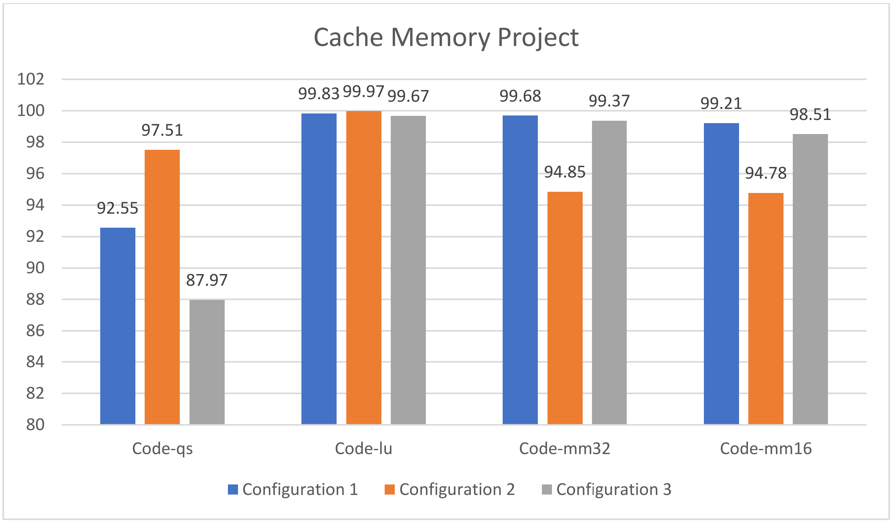

# Memory-Simulator
A Verilog-based Simulator of a Set-Associative Cache and Memory Interaction.

## Requirements
- Verilog should be installed in order to run all needed files.

## Steps to run code
- Change the file-name in the path in `fetch.v`, according to the trace-sample needed to be ran. (All the traces are placed in the `Traces` folder. [Source for traces.](http://www.cs.toronto.edu/~reid/csc150/02f/a2/traces.html))
- Change the dimensions in the `global_variables.v` and `cache_memory.v`, present at the top of the modules in both.
- Finally, just run the `cache_memory.v` file and the results will be displayed in the output window.

## Results on the above mentioned traces

## Contributors
Sahil Safy, Tanmay Shrivastav, Anikesh Parashar, Sanidhya Singh, Prerna, Ayushka Sahu.

Made as Course Project for CSN221, Autumn Semester 2022 (IITR)